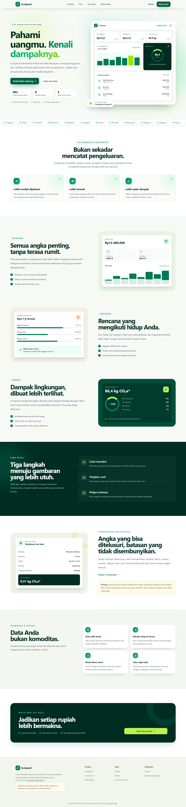
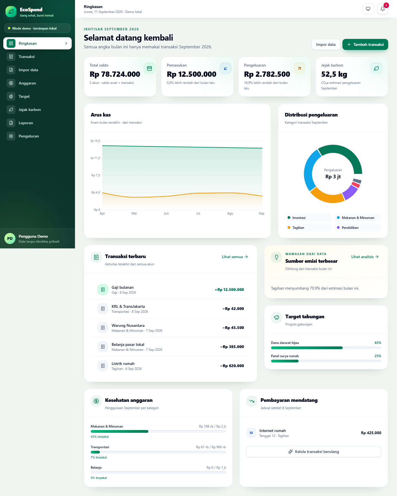
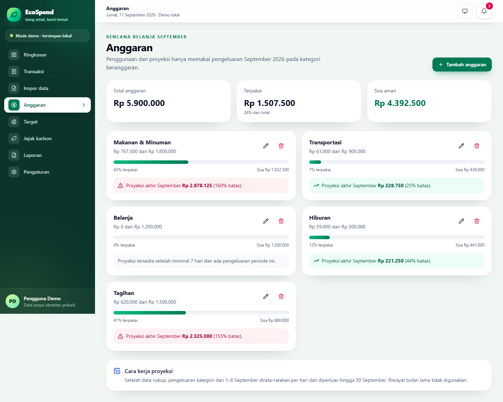
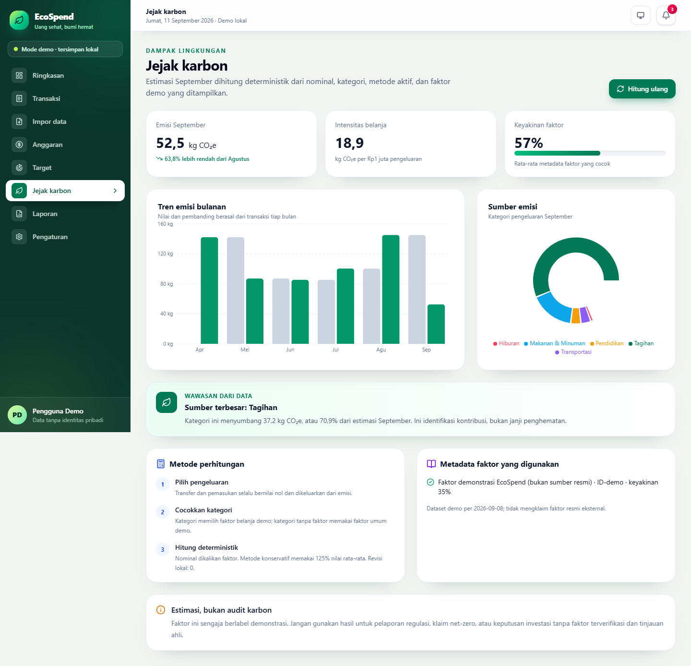

# EcoSpend

EcoSpend adalah aplikasi web pencatat keuangan pribadi yang menghubungkan transaksi, anggaran, target, laporan, dan perkiraan jejak karbon dalam satu dasbor. Repository saat ini menyediakan dua jalur yang jelas: mode demo lokal tanpa backend dan mode akun nyata berbasis Supabase.

> **Status rilis:** aplikasi **live** di produksi dengan CI GitHub Actions hijau dan seluruh quality gates lulus. Mode akun nyata berbasis Supabase sudah aktif: migration dan seed sudah diterapkan ke database production, registrasi email terverifikasi bekerja, dan isolasi RLS terbukti menolak akses anonim terhadap data finansial pengguna.

## Tautan dan tangkapan layar

- **Repository GitHub:** <https://github.com/Leira-ai/ecospend>
- **Aplikasi live:** <https://ecospend-ten.vercel.app>
- **Mode demo langsung:** <https://ecospend-ten.vercel.app/dashboard?demo=1>
- **CI:** [GitHub Actions](https://github.com/Leira-ai/ecospend/actions) — lulus pada commit terbaru.

| Landing | Dashboard demo |
| --- | --- |
|  |  |

| Anggaran | Jejak karbon |
| --- | --- |
|  |  |

## Fitur yang tersedia

- Mode demo eksplisit melalui `/dashboard?demo=1`, memakai data sintetis dan penyimpanan browser; tidak mengirim data ke Supabase.
- Supabase opsional untuk autentikasi SSR: daftar, masuk, konfirmasi email, lupa/reset kata sandi, callback, logout, proteksi dasbor, dan onboarding akun.
- Data API terautentikasi untuk profil, akun, kategori, transaksi, anggaran, target, transaksi berulang, aturan merchant, notifikasi, karbon, impor, ekspor, dan penghapusan akun.
- Onboarding untuk nama tampilan, mata uang, zona waktu, siklus anggaran, target tabungan, tema, notifikasi, dan preferensi karbon.
- Lampiran transaksi privat (JPEG/PNG/WebP/PDF, maksimum 10 MiB) dengan Storage RLS dan signed download URL 60 detik.
- Transfer atomik melalui RPC PostgreSQL yang membuat pasangan debit/kredit tertaut dan memvalidasi pemilik, akun aktif, nominal, dan mata uang.
- Pembangkitan transaksi berulang yang terautentikasi dan idempoten; occurrence guard mencegah tanggal jadwal yang sama dibuat dua kali.
- Ekspor akun sebagai JSON yang dipaginasi, meredaksi field internal, dan menetralkan formula spreadsheet; penghapusan akun membersihkan objek lampiran privat sebelum data/auth dihapus.
- Impor CSV/XLSX, filter/tabel, anggaran, target, laporan, tema responsif, notifikasi dalam aplikasi, dan shell PWA dasar.

## Stack

- Next.js 16 App Router, React 19, TypeScript, Tailwind CSS
- Supabase Auth, PostgreSQL, Row Level Security, Storage, dan SSR client
- React Hook Form, Zod, TanStack Table, Recharts, ExcelJS
- Vitest/React Testing Library, Playwright/Axe, pgTAP, ESLint, TypeScript, Knip

## Arsitektur ringkas

`src/app/` berisi UI dan Route Handlers, `src/components/` fitur interaktif, `src/lib/` domain/validasi/adapter, dan `supabase/` migrasi, seed sintetis, serta pgTAP. Dasbor memilih `DemoProvider` hanya ketika query `demo=1`; jalur akun memakai `AuthenticatedStoreProvider` dan Route Handlers. RLS/constraint database adalah batas otorisasi dan integritas terakhir, bukan filter UI.

Nilai uang disimpan sebagai `BIGINT` satuan minor dan diserialisasi sebagai string di batas JSON. Estimasi karbon menyimpan snapshot faktor dan provenance agar hasil lama tetap dapat ditelusuri. Detail: [arsitektur](docs/architecture.md), [keamanan](docs/security.md), [quality gates](docs/quality-gates.md), dan [pengujian database](docs/database-testing.md).

## Menjalankan lokal

### Prasyarat

- Node.js 24 atau lebih baru
- npm
- Docker dan Supabase CLI 2.117.0 hanya untuk backend/database lokal

### Mode demo

```bash
git clone https://github.com/Leira-ai/ecospend.git
cd ecospend
npm ci
cp .env.example .env.local
npm run dev
```

Buka `http://localhost:3000/dashboard?demo=1`. Pada PowerShell gunakan `Copy-Item .env.example .env.local`. Nilai Supabase boleh kosong; mode demo dipilih secara eksplisit oleh query `demo=1` dan tidak membuktikan integrasi backend.

### Mode Supabase lokal

```bash
supabase start -x realtime,imgproxy,mailpit,postgres-meta,studio,edge-runtime,logflare,vector,supavisor
supabase status
```

Salin Project URL lokal ke `NEXT_PUBLIC_SUPABASE_URL` dan publishable/anon key lokal ke `NEXT_PUBLIC_SUPABASE_ANON_KEY` dalam `.env.local`, lalu jalankan `npm run dev`. `supabase start` menerapkan migrasi serta `supabase/seed.sql`; data seed bersifat sintetis.

## Variabel lingkungan

[`.env.example`](.env.example) mendefinisikan semua nama frontend saat ini:

- `NEXT_PUBLIC_APP_URL`: origin publik untuk canonical metadata, sitemap, dan konfigurasi URL aplikasi; gunakan `http://localhost:3000` saat lokal.
- `NEXT_PUBLIC_SUPABASE_URL`: URL proyek Supabase HTTPS, atau HTTP loopback saat lokal.
- `NEXT_PUBLIC_SUPABASE_ANON_KEY`: anon/publishable key Supabase.

URL dan key harus diisi bersama untuk mode akun. Keduanya terlihat di browser dan hanya aman dengan RLS/Storage policy. Jangan pernah menaruh `service_role`, JWT secret, atau password database pada `NEXT_PUBLIC_*`.

## Migrasi dan database lokal

Migrasi di `supabase/migrations/` adalah sumber kebenaran untuk schema, constraint, indeks, trigger, RLS, Storage, RPC transfer/penghapusan akun, dan recurring generation. Untuk membuat ulang database lokal:

```bash
supabase db reset --local --yes
supabase db lint --level warning
supabase test db
```

`db reset` menghapus data database lokal, menerapkan seluruh migrasi, lalu menjalankan seed. Jangan arahkan perintah reset ke produksi. Lihat [docs/database-testing.md](docs/database-testing.md).

## Quality gates

Status lokal yang diverifikasi pada repository saat ini:

- 97 tes Vitest/RTL lulus (`npm test`).
- 132 tes pgTAP lulus (`supabase test db`).
- 10 tes Playwright Chromium, termasuk tiga scan Axe, lulus (`npm run test:e2e -- --project=chromium`).
- ESLint, typecheck, Knip untuk file/dependency/devDependency, Supabase lint, dan build produksi lulus.
- `npm audit` melaporkan 0 vulnerability.
- Build Next.js 16.3.4 menghasilkan 32 halaman statis/dinamis teroptimasi ditambah Proxy middleware.

Perintah utama:

```bash
npm run lint
npm run typecheck
npm test
npm run build
npm run audit
npm run knip
npm run test:e2e:install
npm run test:e2e -- --project=chromium
```

Knip bersifat blocking untuk file yang tidak digunakan serta dependency/devDependency yang tidak digunakan; configuration hint informasional bukan temuan blocking. Alur Playwright E2E yang sama juga dijalankan langsung terhadap URL produksi `ecospend-ten.vercel.app` dan lulus 10/10, termasuk tiga scan Axe.

## CI

`.github/workflows/ci.yml` berjalan pada push/pull request ke `main` dan `master`, memakai Node.js 24, action yang dipin ke commit, serta job terpisah untuk quality, Playwright/Axe, dan Gitleaks 8.30.1 (checksum terverifikasi). CI memberi konfigurasi Supabase kosong dan membangun mode demo. Status terkini: **CI lulus (hijau)** pada commit `f75eaf6` di `main`, termasuk job quality, E2E/Axe, dan Gitleaks.

## Deployment

EcoSpend terdeploy di Vercel (Hobby/free tier) dari repository GitHub ini:

- Production URL: <https://ecospend-ten.vercel.app>
- Build: Next.js 16.3.4, Node.js 24, 32 route + Proxy middleware.
- Header keamanan produksi terverifikasi (CSP, HSTS, nosniff, X-Frame-Options, Referrer-Policy).
- Smoke test produksi lulus: landing, dashboard demo, metodologi, manifest, robots, sitemap, dan login mengembalikan 200.

Mode akun nyata sudah diaktifkan pada produksi melalui langkah berikut (dokumentasi untuk reproduksi):

1. Buat proyek Supabase (free tier), lalu terapkan migrasi melalui `supabase db push --include-all` dan seed lewat `supabase db query --linked -f supabase/seed.sql`; jangan memakai `db reset` pada produksi.
2. Tetapkan `NEXT_PUBLIC_SUPABASE_URL`, `NEXT_PUBLIC_SUPABASE_PUBLISHABLE_KEY`, dan `NEXT_PUBLIC_APP_URL=https://ecospend-ten.vercel.app` pada environment variables Vercel (Production dan Preview), lalu redeploy.
3. Konfigurasikan Site URL dan Redirect URL `https://ecospend-ten.vercel.app/auth/callback` di Supabase Authentication → URL Configuration.
4. Terverifikasi pada produksi: registrasi email mengirim konfirmasi, role `anon` ditolak RLS pada tabel finansial, dan bucket attachment privat tersedia. Uji tambahan yang disarankan berkala: transfer, recurring generation, ekspor, serta penghapusan akun.

## Uang dan karbon

- Uang memakai `BIGINT` satuan minor, bukan floating point; jangan mengubah nilai database besar ke JavaScript `number` tanpa pemeriksaan rentang.
- Estimasi aktivitas memakai `jumlah × faktor kgCO₂e/unit`; estimasi berbasis belanja memerlukan penyelarasan mata uang, wilayah, tahun, dan kategori.
- Hasil adalah estimasi CO₂e, bukan pengukuran langsung, audit, sertifikasi, atau saran finansial.
- Faktor demo di seed/UI bersifat sintetis atau disederhanakan, dapat usang, dan tidak layak untuk ESG, regulasi, klaim lingkungan, investasi, atau perbandingan ilmiah.
- Hindari penghitungan ganda antara aktivitas dan belanja untuk kejadian yang sama.

## Batasan saat ini

- Mode demo tetap tersedia secara lokal dan independen dari backend; data demo bersifat sintetis.
- Konfirmasi email production menggunakan pengirim bawaan Supabase free tier (rate limit terbatas); untuk produksi serius, pasang SMTP kustom di Supabase Auth.
- Rate limit pada beberapa endpoint adalah best-effort per server instance, bukan limit terdistribusi.
- Shell PWA hanya menyimpan halaman offline dan aset publik minimum; tidak ada cache data privat, offline penuh, mutasi offline, background sync, atau resolusi konflik.
- Faktor karbon demo bukan dataset produksi.
- Paket gratis hosting/Supabase memiliki batas kuota, performa, egress, retensi, dan availability.
- Kinerja produksi belum diukur dengan PageSpeed/Lighthouse terpelihara; alat otomatis performa yang membawa dependency rentan sengaja tidak dipakai.

## Lisensi

Dilisensikan dengan [MIT License](LICENSE). Hak cipta © 2026 Leira.
